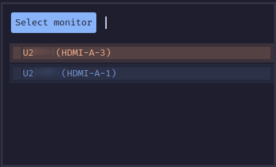

# rofi-ddc-inputs

[Rofi](https://github.com/davatorium/rofi/) script that uses [ddcutil](https://www.ddcutil.com/) to show an input source menu for all connected monitors. This lets you change the input source of any connected monitor *without actually touching said monitor*.

## Setup

Copy `monitor-input.sh` to `~/.config/rofi/scripts`.

Inside the script, edit the `DDC_I2C_BUSES` variable to contain the i2c bus addresses of your monitors.

> Run this to find out what those are:
> ```sh
> ddcutil detect -t | grep -o "i2c-[0-9]$" | grep -o "[0-9]$" | sort | uniq
> ```

## Usage

`rofi -show monitor-input`

### Monitor Selection



### Input Selection


